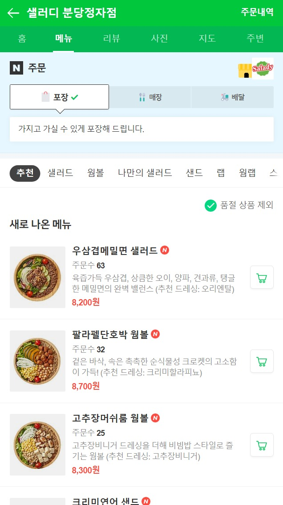

# 마크업 언어를 복기해본다.

https://m.booking.naver.com/order/bizes/411966/items/3589612?theme=place&entry=pll&area=pll

해당 사이트의 레이아웃, 마크업을 제작해본다.
# Day 1
기본 CSS를 사용하기 보다 React에서 사용하는 Styled-Components처럼 작성할 수 있는 Sass를 사용해본다. 개발하는데에 있어 효율을 증가시켜주기때문에 선택이 아닌 `필수`라는 인식이 있음.

Sass는 컴파일을 통해 CSS파일을 만들어 준다고 한다. Styled-Components처럼 `변수`사용, `중첩 객체`, `mixins` 등의 다양한 기능을 제공해준다고 한다.

## CSS코드로 스타일링의 단점
- 가독성의 저하 (프로젝트가 커지게 되면 어디부터 어디까지가 어떤 스타일링을 담당하는지 몰라)
- 첫 번째의 이유로 중복 코드를 작성하기 쉬움
- 단순 수정에도 코드확인이 필요하게 돼
- 때문에 프로젝트가 커짐에 따라 작업속도가 뎌뎌지게 된다.

## 기본 Base
- VScode의 Watch Sass를 사용해서 Sass파일을 컴파일 해
- abstracts에는 많은 색상들에 대한 변수화가 진행.
- base에는 reset.css가 적용되어있음
- components에는 프로젝트에 사용될 컴포넌트의 스타일링을 진행하지
- pages는 페이지의 스타일링!?

### 👏새로이 알게된 것
- role 속성
role속성은 접근성을 높여주는 속성이다. 아무래도 사용자가 많기때문에 접근성을 높인 정석적인 방식을 사용한듯 함

- scroll-x 스타일링 mixin 적용
```css
@mixin scroll-x {
    overflow-x: auto;
    overflow-y: hidden;
    white-space: nowrap;
    -webkit-overflow-scrolling: touch;
    -ms-overflow-style: none; // IE 스크롤바 감추기
    scrollbar-width: none; // Firefox 스크롤바 감추기
    &::-webkit-scrollbar {
        display: none; // Chrome 스크롤바 감추기
    }
}
```
이렇게 mixin으로 만들어도 되고, 아니면 명확하게 `style`을 만들어서 공통으로 적용되는 요소는 `_preset.scss`에서 불러오게 할 수 있겠군!

# Day 2
- 상단 헤더영역은 현제 `position: fixed;`처리 되어있어서 다음 요소가 `top: 0`에서 시작됨.
`container클래스`에는 header-height + tab-height만큼 padding이 필요. 
하지만 이를 직접 계산하기 보다는 앞서 변수로 선언한 값을 이용하여 관리가 쉽게 해본다.

- 스프라이트 이미지의 사용
네이버 지도에 있는 스프라이트 이미지를 사용해보았다.
스프라이트 이미지의 크기 선언.

- 중앙 정렬을 할 때, 현재 위치의 50% 이동시키고, 나의 width의 -50%만큼 이동하면 완전 중앙정렬이 가능함. (공식처럼 알고있도록)

### 👏새로이 알게된 것
- 스프라이트 이미지 적용
웹페이지의 첫 로딩 속도를 줄여주는 여러 방법 중 하나로 서버로의 요청 횟수를 최소화 해줘서 모바일환경과 같이 한정된 자원을 사용하는 플랫폼의 최적화 방법중에 하나라고 한다.

여러 그림들을 하나의 그림으로 합쳐놓고 CSS의 background-position속성을 이용해 이미지의 특정 부분만을 노출되도록 하는 것 ➡️ 서버로의 요청 횟수를 줄여주면서 사이트 로딩 속도를 줄여주고, 내려받는 이미지의 크기까지 줄여주는 세가지의 효과를 얻을 수 있다.

- `letter-spacing` 속성. 이건 디자인적 요소인것같은데 디자이너들의 요구를 받아드려서 하는것인듯으로 보임

- `aria-hidden: true`: 접근성 영역으로 이모티콘같이 보조 시각장치를 스크린리더가 굳이 읽지 않아도 되게 알려주는 코드. ➡️ 웹 접근성 향상

# Day 3
- 상단 최근 주문영역 작성
메뉴탭에서 사용하던 가로 스크롤을 mixin/preset으로 만들어서 `재사용` (Day 1)
한 줄 말줄임 또한 앞으로 쓰일수도 있기 때문에 mixin/preset으로 만들어서 재사용성을 높임

- 오랜만의 마크업이라 조금 버벅이지만 재미있음

- Sass의 컴포넌트화를 통해 적용된 스타일링을 한번에 확인할 수 있음

- 탭 리스트에서의 blur효과
탭 리스트의 `max-width는 720px`로 고정되어있어 inner-container로 잡아주면서 레이아웃을 잡아줘

`linear-gradient`속성을 사용해서 `흰색 ➡️ 투명색` 효과를 줌으로써 blur효과를 줌

blur요소의 겹침을 방지하기 위해 z-index를 넣어줬나봐.